# PICT - Pixiv Integrated Crawling Toolset

## Current Progress

Refining the robustness. Training SRGAN.

## Content

- PixCrawl core
  - Python
  - Node
- Customized file manager
- IRIS experimental enhancement toolset
  - Super Resolution Solution

## Arch

Front-end(`ember.js`) & back-end(`koa2 with ts`), localhost application

**port: 3000, 4200**

*Note: backend uses 2 types of protocols: HTTP & WebSocket. They share a same port.*

## Initialization - npm modules

### Common

To install the NPM Modules preconfigured, change directory into `/back` and `/front`, respectively, run:

`npm i`

### Back

Change into `/back` and run:

`npm run dev`

If a test application is needed, make a `/back/test` directory and put a `test.ts` in. Run:

`npm run test`

### Front

To run the `ember.js` project, a global ember configuration is suggested:

`(sudo) npm install -g ember`

After installation, change into `/front` directory and run:

`ember serve`

## Technical Overview

